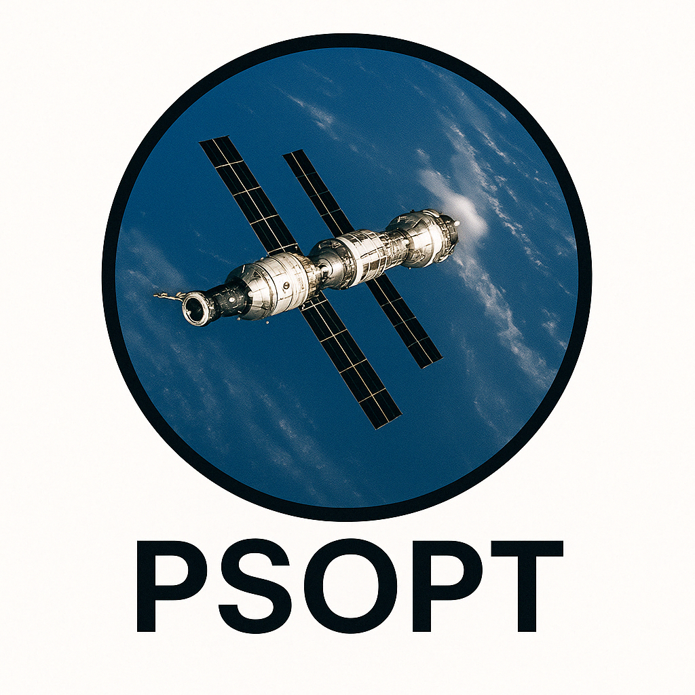

<p align="center">
  
</p>

Status
------

[](https://www.gnu.org/licenses/lgpl-3.0)
[](https://github.com/PSOPT/psopt/releases)
[](https://github.com/PSOPT/psopt/tree/master/doc)
[](https://github.com/PSOPT/psopt/stargazers)
[](https://doi.org/10.5281/zenodo.15367119)


## 🛰 Sponsor PSOPT

PSOPT is an open-source software package for solving optimal control problems, used by [NASA, DLR, and many top universities worldwide](https://www.psopt.net/publications)

If you benefit from PSOPT, please consider [sponsoring its development](https://github.com/sponsors/psopt) to help support continued improvements, maintenance, and community support.

[](https://github.com/sponsors/psopt)

Introduction
------------

This is the PSOPT library, a software tool for computational [optimal control](http://www.scholarpedia.org/article/Optimal_control)

PSOPT is an open source optimal control package written in C++ that primarily uses [direct collocation methods](https://epubs.siam.org/doi/pdf/10.1137/16M1062569). These methods solve optimal control problems by approximating the time-dependent variables using global or local polynomials. This allows to discretize the differential equations and continuous constraints over a grid of nodes, and to compute any integrals associated with the problem using well known quadrature formulas. [Nonlinear programming](https://en.wikipedia.org/wiki/Nonlinear_programming) then is used to find local optimal solutions. PSOPT is able to deal with problems with the following characteristics:

-  Single or multiphase problems
-  Continuous time nonlinear dynamics
-  General endpoint constraints
-  Nonlinear path constraints (equalities or inequalities) on states and/or control variables
- Integral constraints
-  Interior point constraints
-  Bounds on controls and state variables
-  General cost function with Lagrange and Mayer terms.
-  Free or fixed initial and final conditions
- Linear or nonlinear linkages between phases
-  Fixed or free initial time
-  Fixed or free final time
- Optimisation of static parameters
- Parameter estimation problems with sampled measurements • Differential equations with delayed variables.

The implementation has the following features:

- Choice between Legendre, Chebyshev, Radau, Gauss, trapezoidal, or Hermite-Simpson based collocation
- Automatic scaling
- Automatic first and second derivatives using the CppAD library
- Optional numerical differentiation by using sparse finite differences for both Jacobian and Hessian.
- Bett's automatic mesh refinement for local discretisations
- HP-adaptive mesh refinement for pseudospectral discretisations (Radau, Gauss, Legendre, Chebyshev).
- Integrated-residual transcription, useful for singular and non-smooth problems.
- Automatic identification of the Jacobian and Hessian sparsity.
- DAE formulation, so that differential and algebraic constraints can be implemented in the same C++ function.
- A Python interface, enabling users to create models without writing a single line of C++, while benefiting from the speed and power of PSOPT's C++ core computational engine.

The PSOPT interface uses both Eigen3 (a linear algebra template library) and CppAD (an automatic differentiation library).

The first release of PSOPT was published in 2009. 

The PSOPT website is [http://www.psopt.net](http://www.psopt.net).


License
----------


This library is free software; you can redistribute it and/or
modify it under the terms of the GNU Lesser General Public
License as published by the Free Software Foundation; either
version 2.1 of the License, or (at your option) any later version.

This library is distributed in the hope that it will be useful,
but WITHOUT ANY WARRANTY; without even the implied warranty of
MERCHANTABILITY or FITNESS FOR A PARTICULAR PURPOSE.  See the GNU
Lesser General Public License for more details.

You should have received a copy of the GNU Lesser General Public
License along with this library; if not, write to the Free Software
Foundation, Inc., 51 Franklin Street, Fifth Floor, Boston, MA  02110-1301  USA,
or visit http://www.gnu.org/licenses/

Author:    Professor Victor M. Becerra

e-mail:    v.m.becerra@ieee.org


Rolling Release
---------------

From March 2025 PSOPT features a rolling release mode. Rolling release  is a concept in software development of frequently delivering updates to applications. This is in contrast to a standard or point release development model which uses software versions which replace the previous version. Users can download the latest source code from the GitHub repository. The documentation will also be updated  on a rolling release basis.

PSOPT documentation
-------------------

Please consult the [PSOPT User Manual (in PDF format)](https://github.com/PSOPT/psopt/blob/master/doc/PSOPT_Manual_RR.pdf) for further details on the software functionality and how to use it. 

There is also a [PSOPT Application Examples Document (in PDF format)](https://github.com/PSOPT/psopt/blob/master/doc/PSOPT_Application_Examples_Document_RR.pdf), which contains several application examples in various engineering/scientific domains, including their C++ code and results. 

Installation instructions are given below.


Installing PSOPT
----------------

Please consult the [PSOPT User Manual](https://github.com/PSOPT/psopt/blob/master/doc/PSOPT_Manual_RR.pdf) for further details on the software functionality and how to use it. 

PSOPT relies on three main software packages to perform a number of tasks: IPOPT, CppAD and EIGEN3. Some of these packages have their own dependencies.


**IPOPT**

IPOPT is an open-source C++ package for large-scale nonlinear optimization, which uses an interior point method. It is the default nonlinear programming algorithm used by PSOPT. IPOPT can be easily installed using a package manager in some, but not all, Linux distributions.

​	•	IPOPT repository:

​	https://github.com/coin-or/Ipopt

​	•	Version 3.12.12 is tested, but other versions may work.

​	https://www.coin-or.org/download/source/Ipopt/

​	•	Installation guide:

​	https://coin-or.github.io/Ipopt/INSTALL.html


**EIGEN3**

[Eigen](http://eigen.tuxfamily.org/) is a lightweight, powerful linear algebra package for C++. Eigen is available on most major Linux distributions.


If necessary, Eigen can also be installed using CMake:

```
wget --continue https://gitlab.com/libeigen/eigen/-/archive/3.3.7/eigen-3.3.7.tar.gz
tar zxvf eigen-3.3.7.tar.gz
cd eigen-3.3.7
mkdir build
cd build
cmake ..
sudo make install
```


The following optional libraries can be employed for additional functionality.

**SNOPT**


[SNOPT](http://www.sbsi-sol-optimize.com/manuals/SNOPT-Manual.pdf) is an optimization algorithm for large-scale nonlinearly constrained problems based on sequential quadratic programming.


**GNUplot**


[GNUplot](http://www.gnuplot.info) is a portable, interactive data and function plotting utility. GNU plot is available on most Linux distributions. PSOPT includes a number of functions that allow to easily plot results using GNUplot.


**Building PSOPT**


PSOPT relies on [CMake](https://cmake.org/download/)  and '[pkg-config](https://en.wikipedia.org/wiki/Pkg-config)' for configuring builds, and on 'make' for managing compilation and linking.

CMake is an open-source tool for managing software builds. PSOPT requires CMake 3.12 or later. 

pkg-config is a helper tool used to provide the necessary details for compiling and linking a program to a library. It ensures that PSOPT’s dependencies are found correctly. pkg-config is available on most major Linux distributions. In particular, the build process expects to see pkg-config configuration files for IPOPT, ColPack and CppAD. These configuration files are usually installed under /usr/local/lib/pkgconfig or /usr/lib/pkgconfig. If these configuration files are not created during the build process for the above libraries, they can be created manually and be placed at the correct folder. If the pkg-config configuration files are being created manually, the contents of these files on the authors' computer are provided below as examples. Please note that the paths that are given in these files depend on the actual location where the different libraries have been installed.

For IPOPT (filename: ipopt.pc):

	prefix=/usr/local
	exec_prefix=${prefix}
	libdir=${exec_prefix}/lib
	includedir=${prefix}/include/coin-or
	Name: IPOPT
	Description: Interior Point Optimizer
	URL: https://github.com/coin-or/Ipopt
	Version: 3.13.2
	Cflags: -I${includedir}
	Libs: -L${libdir} -lipopt
	Requires.private: coinhsl coinmumps 


	
For EIGEN3 (filename: eigen3.pc):

```
prefix=/usr/local
exec_prefix=${prefix}
libdir=${exec_prefix}/lib
includedir=${prefix}/include

Name: Eigen3
Version: 3.3.77
Description: Numerical linear algebra library for C++
Requires: 
Libs:  -Wl,-rpath,${libdir} -L$${libdir}  
Cflags: -I${includedir} -std=c++11
```

For SNOPT (filename: snopt7.pc):
	

```
prefix=/usr/local
exec_prefix=${prefix}
libdir=${exec_prefix}/lib
includedir=${prefix}/include/snopt7

Name: SNOPT7
Version: 7
Description: SNOPT NONLINEAR PROGRAMMING LIBRARY 
Requires: 
Libs: -L${libdir} -lsnopt7_cpp -Wl,-rpath,${libdir} -Wl,-rpath,${libdir} 
Cflags: -I${includedir}
```


**Tested Platforms**

PSOPT has been successfully compiled on:

​	•	Ubuntu Linux 24.04 LTS

​	•	OpenSUSE Linux 15.5 Leap and Tumbleweed

​	•	Arch Linux (latest versions as of 2025)

​	•	Manjaro Linux  (latest versions as of 2025)

​	•	MacOS Tahoe version 26.4.1 (MacPorts on Intel CPU)


**Installing Dependencies**


For **Ubuntu 24.04**:

```
sudo apt-get install git cmake gfortran g++ libboost-dev libboost-system-dev \
  coinor-libipopt-dev gnuplot libeigen3-dev libblas-dev liblapack-dev libcppad-dev
```


For **Debian 12.9.0**:

```
su
apt-get install git cmake gfortran g++ libboost-dev libboost-system-dev \
  coinor-libipopt-dev gnuplot libeigen3-dev libblas-dev liblapack-dev libcppad-dev
```


For **OpenSUSE Leap 15.5 and Tumbleweed**:

```
sudo zypper install git gnuplot libboost_system1_66_0-devel eigen3-devel \
  blas-devel lapack-devel Ipopt-devel cmake gcc-c++

git clone https://github.com/coin-or/CppAD.git cppad.git
cd cppad.git
mkdir build && cd build
cmake -D cppad_prefix=/usr/local ..
make
sudo make install
```
That installs CppAD headers to /usr/local/include/cppad/ and the library to /usr/local/lib/, both of which PSOPT's CMake finds on the default search path — no extra flags needed.
If you install CppAD to a non-standard prefix, point PSOPT at it when configuring, e.g.:
```
export CPPAD_DIR=/your/prefix      # or: cmake -DCPPAD_INCLUDE_DIR=... -DCPPAD_LIBRARY=...
```


For **Arch Linux / Manjaro**:

```
sudo pacman -Syu
sudo pacman -S git base-devel cmake gnuplot eigen boost blas lapack yay
yay -S coin-or-ipopt colpack cppad
```


The use of the tool **yay** requires AUR support to be enabled on the package manager. On ARM64, it may be necessary to install [Anaconda]([https://www.anaconda.com/download), which provides gklib and IPOPT, as the installation script for IPOPT provided by AUR currently fails to build using yay.


For **MacOS**

PSOPT can be built on macOS using [MacPorts](https://www.macports.org/install.php) for most
of its dependencies. **Do not** install IPOPT from MacPorts, however: on Apple Silicon
(M1/M2/M3/M4) the MacPorts `ipopt` package is built against a *parallel* (MPICH) build of
MUMPS that calls `MPI_Init` at library-load time and crashes when an example is run directly.
Instead, build IPOPT and MUMPS yourself, as a *sequential* solver, with the steps below. This
procedure has been used successfully on Apple Silicon (M2 Max, M4 Pro) and on Intel Macs.

*1. Install MacPorts*

Download and install MacPorts from https://www.macports.org/install.php

*2. Install the dependencies (via MacPorts)*

```
sudo port install cmake
sudo port install eigen3
sudo port install git
sudo port install gnuplot
sudo port install pkgconfig
sudo port install gcc15        # provides gfortran (/opt/local/bin/gfortran-mp-15)
```

Notes:
- The MacPorts `ipopt` port is deliberately **omitted** — it is built in step 3 instead.
- `gcc15` is needed only for its Fortran compiler, `gfortran`, which is required to compile
  MUMPS. It installs as `/opt/local/bin/gfortran-mp-15`. If you install a different GCC
  version, adjust the `-mp-NN` suffix accordingly in step 3.


_3. Build IPOPT + MUMPS (sequential) with coinbrew_

```
git clone https://github.com/coin-or/coinbrew ~/coinbrew
cd ~/coinbrew
./coinbrew fetch Ipopt --no-prompt

export CC=/usr/bin/clang
export CXX=/usr/bin/clang++
export FC=/opt/local/bin/gfortran-mp-15

./coinbrew build Ipopt --prefix=$HOME/coin/dist --no-prompt \
      ADD_FFLAGS=-fallow-argument-mismatch
```

_4. Build CppAD_

```
git clone https://github.com/coin-or/CppAD.git cppad.git
cd cppad.git
mkdir build && cd build
cmake -D cppad_prefix=/usr/local ..
make
sudo make install
```
That installs headers to /usr/local/include/cppad/ and the library to /usr/local/lib/, both of which PSOPT's CMake finds on the default search path — no extra flags needed.

If you install CppAD to a non-standard prefix, point PSOPT at it when configuring, e.g.:
```
export CPPAD_DIR=/your/prefix      # or: cmake -DCPPAD_INCLUDE_DIR=... -DCPPAD_LIBRARY=...
```

Why these settings matter:
- **`CC`/`CXX` = Apple clang** make IPOPT use the `libc++` C++ standard library, matching PSOPT
  and the MacPorts libraries. Building IPOPT with the MacPorts `g++` instead links `libstdc++`,
  whose `std::string` is binary-incompatible with `libc++` and causes a segmentation fault as
  soon as PSOPT passes options to IPOPT.
- **`FC` = gfortran** compiles MUMPS; `ADD_FFLAGS=-fallow-argument-mismatch` lets recent gfortran
  accept MUMPS's legacy Fortran.
- coinbrew builds MUMPS with its **sequential MPI stub**, so there is no MPICH and no load-time
  `MPI_Init` — the root cause of the MacPorts crash.
- Apple's **Accelerate** framework is detected automatically and used as a fast BLAS/LAPACK
  (excellent on Apple Silicon); no extra flag is needed.

If the build stops at the IPOPT **Java** unit test (this is harmless — it only fails when your
system `java` is an Intel/x86_64 JVM that cannot load the arm64 library), finish the install
manually:

```
cd ~/coinbrew/build/Ipopt/*/ && make install
```

_4. Verify the build_

```
otool -L ~/coin/dist/lib/libipopt.3.dylib | grep -iE 'mpi|c\+\+|stdc'
```

You should see `/usr/lib/libc++.1.dylib` and **no** `libmpi`, `libpmpi`, or `libstdc++`. That
confirms IPOPT is sequential (no MPI) and on the correct C++ standard library.

_5. Build PSOPT against your IPOPT_

```
export PKG_CONFIG_PATH=$HOME/coin/dist/lib/pkgconfig:$PKG_CONFIG_PATH

cd /path/to/psopt
rm -rf build
cmake -B build -DCMAKE_BUILD_TYPE=Release -DBUILD_EXAMPLES=ON \
      -DCMAKE_PREFIX_PATH=$HOME/coin/dist \
      -DCMAKE_BUILD_RPATH=$HOME/coin/dist/lib \
      -DCMAKE_INSTALL_RPATH=$HOME/coin/dist/lib
cmake --build build -j
```

Add the `PKG_CONFIG_PATH` line to your `~/.zshrc` so that future reconfigures continue to find
this IPOPT (and place `~/coin/dist/lib/pkgconfig` *before* `/opt/local/lib/pkgconfig`).

_6. Run an example_

```
cd build/examples/launch && ./launch
```


**Building and Installing PSOPT**

Once all dependencies are installed, PSOPT can be downloaded from GitHub, and built using CMake using the following commands.

```
git clone --tags https://github.com/PSOPT/psopt.git
cd psopt
mkdir build
cd build
cmake -DBUILD_EXAMPLES=ON ..
make
sudo make install
```

If using SNOPT:

```
cmake -DBUILD_EXAMPLES=ON -DWITH_SNOPT_INTERFACE=ON ..
```

For debugging:

```
cmake -DBUILD_EXAMPLES=ON -DCMAKE_BUILD_TYPE=Debug ..
```

After installation, run at least one example to check that the build is working correctly:

```
cd build/examples/launch
./launch
```


Running PSOPT within a Docker container
----------------

Docker containers are relatively small, standalone, executable software packages that include everything needed to run an application, such as code, runtime, libraries, and system tools. Containers are a form of operating system virtualisation. To use dockers containers, you need to install suitable software.  For instance, you can install Docker Desktop for [Windows 11](https://docs.docker.com/desktop/setup/install/windows-install/), [MacOS](https://docs.docker.com/desktop/setup/install/mac-install/), and various distributions of [Linux](https://docs.docker.com/desktop/setup/install/linux/).

The current distribution of PSOPT provides a Docker container file (Dockerfile). This provides an alternative way of installing and running PSOPT. 

The following are opportunities provided by the use of docker containers with PSOPT.

-**Reproducible Environments:** A Docker container ensures PSOPT is run with the same OS libraries, compiler, and dependencies, eliminating configuration mismatches, regardless of the host OS.

-**Easier Setup:** Users avoid manually installing IPOPT, COLPACK, EIGEN3, and other dependencies. A single docker build command spins up a ready-to-run PSOPT environment.

-**Continuous Integration (CI) Testing:** Automated pipelines (e.g. GitHub Actions) can pull and test PSOPT in a Docker image, allowing fast and consistent builds.

-**Cloud or HPC Deployment:** Clusters often support container-based workloads. Docker images simplify running large-scale optimal control problems in cloud services or high-performance computing environments.

As it is not easy to get a docker to display graphical output (such as GNUplot plots), it is best to run PSOPT in headless mode (no graphical output) within the docker container, and visualise any graphical output from the host operating system (e.g. by opening any PDF files that PSOPT may have produced).

The steps to create a docker container and run PSOPT on the container are as follows:

1. Download [Dockerfile](https://github.com/PSOPT/psopt/blob/master/Dockerfile) from the PSOPT distribution, and place it in a folder. This Dockerfile uses [archlinux](https://hub.docker.com/_/archlinux/) as the base. This file clones the latest source code for PSOPT available from GitHub. If you have created your own version (for instance, to include your own examples or cases), you can modify the Dockerfile to copy your own source tree.

2. In your terminal, cd to the same folder where the Dockerfile is. The command to build the docker container (including PSOPT) is as follows: 
```
docker build -t psopt-archlinux:latest .
```
The above command reuses a previous container with the same name, if it exists. If you want to rebuild the whole container use the following command:
```
docker build --no-cache -t psopt-archlinux:latest .
```
3. Issue the following command to run the docker container interactively:
```
docker run -it psopt-archlinux:latest 
```
This will land you in the main 'psopt' folder. From there cd to 'build/examples' to run particular examples, etc.

4. Alternatively, you can use the following command to run the docker container interactively with a data connection to the host 

```
docker run -it --rm -v "$HOME/data:/data" psopt-archlinux:latest 
```
Here, the shared folder is "$HOME/data" as seen from the host, and "/data" as seen from the container.

From within the container, cd to 'build/examples' to run particular examples, etc.
Any output files must be manually copied to the folder /data from within the container. The copied files (e.g. PDFs or .txt files) appear within the corresponding directory of the host ($HOME/data). The host can send files to the container via the same folder.

Getting help
------------

* **[PSOPT Documentation](https://github.com/PSOPT/psopt/blob/master/doc/)** with information about the functionality and use of the software, background theory, examples, and more.
 * **[Issue tracking system](https://github.com/PSOPT/psopt/issues/)**: If you believe you found a **bug** in the code, please use the issue tracking system.
   Please include as much information as possible, and if possible some example code so that we can reproduce the error.
 * **[Mailing list](http://groups.google.com/group/psopt-users-group)**: subscribe to receive notifications about updates and to post questions and comments about PSOPT.


Please acknowledge this work
----------------------------

This software is provided for free in the hope that it may be useful to others, and we would very much like to hear about your experience with it. If you find PSOPT helpful for your work or research, please email the author at v.m.becerra@ieee.org  to incorporate a feature on the PSOPT web page.

Given that a great deal of time and effort has gone into PSOPT's development, **please cite the following publication if you are using PSOPT for your own research**:

* Becerra, V.M. (2010). [**Solving complex optimal control problems at no cost with PSOPT**](https://ieeexplore.ieee.org/document/5612676). Proc. IEEE Multi-conference on Systems and Control, Yokohama, Japan, September 7-10, 2010, pp. 1391-1396.

**BibTex entry:**

            @INPROCEEDINGS{5612676,  
            author={V. M. Becerra},  
            booktitle={2010 IEEE International Symposium on Computer-Aided Control System Design},          
            title={Solving complex optimal control problems at no cost with PSOPT},   
            year={2010},    
            pages={1391-1396},  
            doi={10.1109/CACSD.2010.5612676}}

If you wish to cite this specific release of PSOPT, you can use the DOI banner at the top of this document.

To cite the software concept using a DOI (meaning citing all releases), you can use the following DOI, which always resolves to the latest release: [10.5281/zenodo.15367118](https://doi.org/10.5281/zenodo.15367118). 

Latest Continuous Integration Test Report 
==========================================

This automated test is based on seven selected examples from the PSOPT distribution and is carried out using GitHub Actions. Any push to the master branch or pull request triggers a complete build of the PSOPT library and the executables for all examples in the distribution, followed by a test run of these seven examples. The build and test runs are performed on a Docker container running Arch Linux. The resulting cost function for each selected example is then compared with a reference value. An example passes the test if the relative absolute difference between the computed cost function in the test and the reference value is lower than a small tolerance.

[View the full PSOPT CI Test Summary](https://psopt.github.io/psopt/artifacts)


Copyright (C) 2009-2025 Victor M. Becerra
