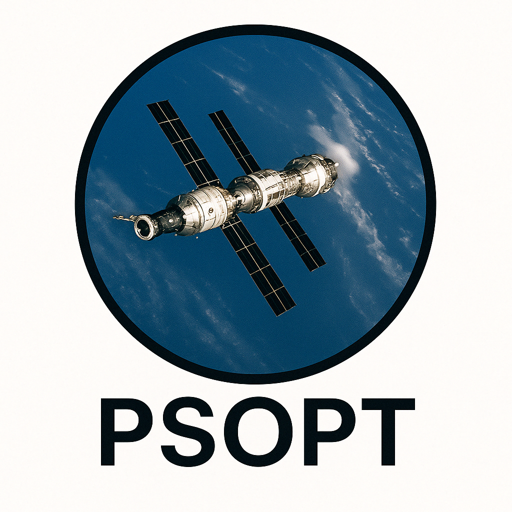

<p align="center">
  
</p>

Status
------

[](https://www.gnu.org/licenses/lgpl-3.0)
[](https://github.com/PSOPT/psopt/releases)
[](https://github.com/PSOPT/psopt/tree/master/doc)
[](https://github.com/PSOPT/psopt/stargazers)
[](https://doi.org/10.5281/zenodo.15367119)


## 🛰 Sponsor PSOPT

PSOPT is an open-source software package for solving optimal control problems, used by [NASA, DLR, and many top universities worldwide](https://www.psopt.net/publications)

If you benefit from PSOPT, please consider [sponsoring its development](https://github.com/sponsors/psopt) to help support continued improvements, maintenance, and community support.

[](https://github.com/sponsors/psopt)

Introduction
------------

This is the PSOPT library, a software tool for computational [optimal control](http://www.scholarpedia.org/article/Optimal_control)

PSOPT is an open source optimal control package written in C++. It transcribes an
optimal control problem into a [nonlinear programming](https://en.wikipedia.org/wiki/Nonlinear_programming)
problem, which is then solved to find a local optimal solution. Three different
transcriptions are provided:

- **Direct collocation** (the default). The time-dependent variables are approximated
  by global or local polynomials, the differential equations and continuous constraints
  are enforced over a grid of nodes, and any integrals associated with the problem are
  computed using well known quadrature formulas. See
  [direct collocation methods](https://epubs.siam.org/doi/pdf/10.1137/16M1062569).
- **Integrated residuals**. The residual of the dynamics is bounded or minimised in an
  integral norm over the whole interval, instead of being forced to zero at selected
  points. This is useful for singular and non-smooth problems, on which collocation can
  converge to a plausible answer at a cost below the true optimum.
- **Direct multiple shooting**. The state at a set of segment boundaries becomes a
  decision variable, the dynamics are integrated across each segment by a fixed-step
  Runge-Kutta scheme, and continuity is imposed as a constraint. Every iterate therefore
  holds trajectory pieces that individually satisfy the differential equations, and the
  conditioning is governed by the growth of the dynamics across one segment rather than
  across the whole horizon.

PSOPT is able to deal with problems with the following characteristics:

-  Single or multiphase problems
-  Continuous time nonlinear dynamics
-  General endpoint constraints
-  Nonlinear path constraints (equalities or inequalities) on states and/or control variables
-  Integral constraints
-  Interior point constraints
-  Bounds on controls and state variables
-  General cost function with Lagrange and Mayer terms
-  Free or fixed initial and final conditions
-  Linear or nonlinear linkages between phases
-  Fixed or free initial time
-  Fixed or free final time
-  Optimal control problems including the optimisation of static parameters, including real and integer (discrete-valued) parameters
-  Optimal control problems with mixed continuous and integer (discrete-valued) controls
-  Parameter estimation problems with sampled measurements
-  Differential equations with delayed variables
-  Differential-algebraic systems, including semi-explicit index-1 systems solved in the form in which they are written

The implementation has the following features:

- Choice between Legendre, Chebyshev, Radau, Gauss, trapezoidal, or Hermite-Simpson based collocation
- An integrated residual transcription with a residual bound, an alternating feasibility and optimality scheme, and a flexible mesh whose element boundaries are decision variables, so that the optimisation can place one at a switching time
- Direct multiple shooting, with a choice of explicit and stiffly accurate implicit Runge-Kutta schemes for stiff dynamics, constant, linear or quadratic controls across a segment, and segment boundaries and integrator step counts that can be chosen automatically
- Automatic scaling
- Automatic first and second derivatives using the CppAD library
- Optional numerical differentiation by using sparse finite differences for both Jacobian and Hessian
- Betts's automatic mesh refinement for local discretisations
- hp-adaptive mesh refinement for pseudospectral discretisations (Radau, Gauss, Legendre, Chebyshev)
- Automatic identification of the Jacobian and Hessian sparsity
- DAE formulation, so that differential and algebraic constraints can be implemented in the same C++ function
- A choice of nonlinear programming solver: IPOPT by default, or PSOPT's own sparse sequential quadratic programming solver, which is optional at build time
- A Python interface, enabling users to create models without writing a single line of C++, while benefiting from the speed and power of PSOPT's C++ core computational engine

The PSOPT interface uses both Eigen3 (a linear algebra template library) and CppAD (an automatic differentiation library).

The first release of PSOPT was published in 2009.

The PSOPT website is [http://www.psopt.net](http://www.psopt.net).


License
----------


This library is free software; you can redistribute it and/or
modify it under the terms of the GNU Lesser General Public
License as published by the Free Software Foundation; either
version 2.1 of the License, or (at your option) any later version.

This library is distributed in the hope that it will be useful,
but WITHOUT ANY WARRANTY; without even the implied warranty of
MERCHANTABILITY or FITNESS FOR A PARTICULAR PURPOSE.  See the GNU
Lesser General Public License for more details.

You should have received a copy of the GNU Lesser General Public
License along with this library; if not, write to the Free Software
Foundation, Inc., 51 Franklin Street, Fifth Floor, Boston, MA  02110-1301  USA,
or visit http://www.gnu.org/licenses/

Author:    Professor Victor M. Becerra

e-mail:    vmbecerra@vmb1.com


Rolling Release
---------------

From March 2025 PSOPT features a rolling release mode. Rolling release  is a concept in software development of frequently delivering updates to applications. This is in contrast to a standard or point release development model which uses software versions which replace the previous version. Users can download the latest source code from the GitHub repository. The documentation will also be updated  on a rolling release basis.

PSOPT documentation
-------------------

Please consult the [PSOPT User Manual (in PDF format)](https://github.com/PSOPT/psopt/blob/master/doc/PSOPT_Manual_RR.pdf) for further details on the software functionality and how to use it. 

There is also a [PSOPT Application Examples Document (in PDF format)](https://github.com/PSOPT/psopt/blob/master/doc/PSOPT_Application_Examples_Document_RR.pdf), which contains several application examples in various engineering/scientific domains, including their C++ code and results. 

Installation instructions are in [doc/install/](doc/install/), one page per platform.


Installing PSOPT
----------------

**The instructions for your platform are in [doc/install/](doc/install/).**

| platform | page |
|---|---|
| Ubuntu 26.04 LTS, Ubuntu 24.04 LTS | [doc/install/ubuntu.md](doc/install/ubuntu.md) |
| Debian 13 | [doc/install/debian.md](doc/install/debian.md) |
| Fedora 44 | [doc/install/fedora.md](doc/install/fedora.md) |
| openSUSE Leap 16.0, Tumbleweed | [doc/install/opensuse.md](doc/install/opensuse.md) |
| Arch Linux, Manjaro | [doc/install/arch.md](doc/install/arch.md) |
| macOS (Apple Silicon and Intel) | [doc/install/macos.md](doc/install/macos.md) |

Each Linux page has an executable counterpart in `containers/`: a Dockerfile
that installs the same packages and then builds PSOPT, runs the tests, installs
it and builds a separate program against the installed package. Those images run
every week on GitHub's runners, so the package lists on those pages are the ones
that were last known to work. There is no container for macOS, so that page alone is maintained by hand.

[doc/install/README.md](doc/install/README.md) collects what is common to all of
them: what the three dependencies are and why, and what to do when the configure
step cannot find one.

**What PSOPT needs.** IPOPT, the interior-point nonlinear programming solver it
uses by default; Eigen, for linear algebra; and CppAD, for automatic
differentiation. GNUplot is optional and affects only the plotting helpers.
Ubuntu, Debian and Fedora package IPOPT; openSUSE and Arch do not, so it is
built from source there, which their pages describe. 

PSOPT builds with CMake 3.12 or later and finds IPOPT through `pkg-config`. It
has been built and tested against IPOPT releases from 3.11.9 to 3.14.19, and
against both Eigen 3.4 and Eigen 5.0.

**Building it**, once the dependencies are in place, is the same everywhere:

```
git clone https://github.com/PSOPT/psopt.git
cd psopt
cmake -B build -DCMAKE_BUILD_TYPE=Release -DBUILD_EXAMPLES=ON
cmake --build build -j
sudo cmake --install build
```

Add `-DCMAKE_BUILD_TYPE=Debug` for a debug build, or `-DHEADLESS=ON` on a
machine with no display. Then run an example, which is the check that matters:

```
cd build/examples/launch && ./launch
```

Configuring with `-DBUILD_TESTS=ON` also builds the unit tests, which are run
with `ctest --test-dir build --output-on-failure`. They check costates against
closed-form adjoints, stationarity residuals, the constancy of the Hamiltonian
and much else, and are the strongest evidence that a build is sound.

**Tested platforms.** Eight images are built and tested weekly, and on every
push: Ubuntu 26.04 LTS, Ubuntu 24.04 LTS, Debian 13, Fedora 44, openSUSE Leap
16.0, openSUSE Tumbleweed, Arch Linux and Manjaro. Each builds PSOPT with that
distribution's own compiler and libraries, runs the full unit test suite,
installs the library, builds a separate project against the installed package,
and runs three examples whose reference answers come from problems with known analytical solutions. macOS is tested by hand on Apple Silicon and Intel. What those jobs
do, and what they deliberately do not check, is in
[containers/README.md](containers/README.md).

Building PSOPT's own SQP solver
----------------

PSOPT ships a sparse sequential quadratic programming (SQP) solver of its own, selected at run time
with `algorithm.nlp_method = "SQP"`. It is off by default and adds no dependency to an
ordinary build: with `WITH_SQP=OFF` the solver compiles to a stub. Everything below is
needed only if you want to build it.

The algorithm is broadly based on the sparse SQP method of Betts, *Practical Methods for
Optimal Control Using Nonlinear Programming*, 3rd ed., chapter 2, with several of its
components left out; the section on the SQP solver in the reference manual lists which components are not adopted,
and what replaces them.

**Should you build it? For most problems, no.** IPOPT is the default NLP solver and
it performs better across the board: it solves more of the shipped examples than the SQP does,
and it solves the ones they share by roughly one to two orders of magnitude faster. If you
have no particular reason to want a second solver, IPOPT is the right choice and this
section is not for you.

The reasons to build it anyway are:

- **A second opinion from a different algorithm.** On the examples both solve, the two
  methods agree to about four significant figures. Two unrelated methods agreeing is a stronger
  statement about a solution than either produces alone.
- **Everything is in this repository.** No third-party NLP interface, no licence to obtain,
  and every part of the method can be read and changed.
- **One shipped example is solved by the SQP and not by IPOPT** (`lqr_radau`).

And the caveats:

- **PSOPT's sparse SQP does not solve everything IPOPT does.** As last measured, it fails outright on one of
  the shipped examples and does not finish within a practical time budget on a further
  handful, where IPOPT succeeds. The proportion moves as the solver changes, so read it as
  indicative: a problem the sparse SQP will not take is one to give to IPOPT.
- **It is slower**, dominated by the QP subproblems, of which there is at least one per
  iteration.
- **It needs `hessian = "exact"` to be usable at any size.** The alternative is a dense
  quasi-Newton model whose storage is quadratic in the number of variables, which a
  collocation mesh of any size will not tolerate.
- **It is newer than the rest of PSOPT** and has had correspondingly less exposure to
  problems its author did not write.

The quadratic programming subproblem goes to one of several backends, every one of them
sparse, and at least one must be built: `WITH_SQP=ON` on its own is an error, because the
SQP has no QP solver of its own. **GALAHAD's QPA is the one to use**: it is sparse, BSD-3
licensed, and the configuration the solver has been tuned and measured against. **PIQP is
the one to try next**: it is header-only, so it costs nothing to have, it
solves a few examples GALAHAD does not, and
over the examples both solve it is several times faster at very nearly the same number of
SQP iterations. Between them, these two QP backends solve every example any backend solves. Clarabel,
ProxQP, QPALM and OSQP are also supported, and solve nothing those two do not.


Instructions to install dependencies and build PSOPT with its own sparse SQP solver can be found at [doc/install/sqp.md](doc/install/sqp.md).


Running PSOPT within a Docker container
----------------

Docker containers are relatively small, standalone, executable software packages that include everything needed to run an application, such as code, runtime, libraries, and system tools. Containers are a form of operating system virtualisation. To use dockers containers, you need to install suitable software.  For instance, you can install Docker Desktop for [Windows 11](https://docs.docker.com/desktop/setup/install/windows-install/), [MacOS](https://docs.docker.com/desktop/setup/install/mac-install/), and various distributions of [Linux](https://docs.docker.com/desktop/setup/install/linux/).

The current distribution of PSOPT provides a Docker container file (Dockerfile). This provides an alternative way of installing and running PSOPT. 

The following are opportunities provided by the use of docker containers with PSOPT.

-**Reproducible Environments:** A Docker container ensures PSOPT is run with the same OS libraries, compiler, and dependencies, eliminating configuration mismatches, regardless of the host OS.

-**Easier Setup:** Users avoid manually installing IPOPT, EIGEN3, CppAD and other dependencies. A single docker build command spins up a ready-to-run PSOPT environment.

-**Continuous Integration (CI) Testing:** Automated pipelines (e.g. GitHub Actions) can pull and test PSOPT in a Docker image, allowing fast and consistent builds.

-**Cloud or HPC Deployment:** Clusters often support container-based workloads. Docker images simplify running large-scale optimal control problems in cloud services or high-performance computing environments.

As it is not easy to get a docker to display graphical output (such as GNUplot plots), it is best to run PSOPT in headless mode (no graphical output) within the docker container, and visualise any graphical output from the host operating system (e.g. by opening any PDF files that PSOPT may have produced).

The steps to create a docker container and run PSOPT on the container can be found at [doc/install/docker.md](doc/install/docker.md)


Getting help
------------

* **[PSOPT Documentation](https://github.com/PSOPT/psopt/blob/master/doc/)** with information about the functionality and use of the software, background theory, examples, and more.
 * **[Issue tracking system](https://github.com/PSOPT/psopt/issues/)**: If you believe you found a **bug** in the code, please use the issue tracking system.
   Please include as much information as possible, and if possible some example code so that we can reproduce the error.


Please acknowledge this work
----------------------------

This software is provided for free in the hope that it may be useful to others, and we would very much like to hear about your experience with it. If you find PSOPT helpful for your work or research, please email the author at vmbecerra@vmb1.com  to incorporate a feature on the PSOPT web page.

Given that a great deal of time and effort has gone into PSOPT's development, **please cite the following publication if you are using PSOPT for your own research**:

* Becerra, V.M. (2010). [**Solving complex optimal control problems at no cost with PSOPT**](https://ieeexplore.ieee.org/document/5612676). Proc. IEEE Multi-conference on Systems and Control, Yokohama, Japan, September 7-10, 2010, pp. 1391-1396.

**BibTex entry:**

            @INPROCEEDINGS{5612676,  
            author={V. M. Becerra},  
            booktitle={2010 IEEE International Symposium on Computer-Aided Control System Design},          
            title={Solving complex optimal control problems at no cost with PSOPT},   
            year={2010},    
            pages={1391-1396},  
            doi={10.1109/CACSD.2010.5612676}}

If you wish to cite this specific release of PSOPT, you can use the DOI banner at the top of this document.

To cite the software concept using a DOI (meaning citing all releases), you can use the following DOI, which always resolves to the latest release: [10.5281/zenodo.15367118](https://doi.org/10.5281/zenodo.15367118). 

Latest Continuous Integration Test Report 
==========================================

This automated test is based on seven selected examples from the PSOPT distribution and is carried out using GitHub Actions. Any push to the master branch or pull request triggers a complete build of the PSOPT library and the executables for all examples in the distribution, followed by a test run of these seven examples. The build and test runs are performed on a Docker container running Arch Linux. The resulting cost function for each selected example is then compared with a reference value. An example passes the test if the relative absolute difference between the computed cost function in the test and the reference value is lower than a small tolerance.

[View the full PSOPT CI Test Summary](https://psopt.github.io/psopt/artifacts)


Copyright (C) 2009-2026 Victor M. Becerra
